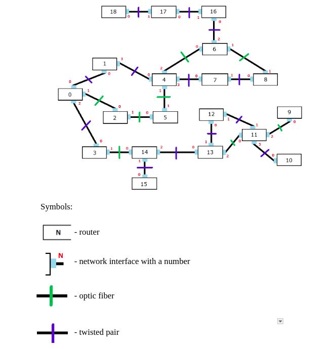
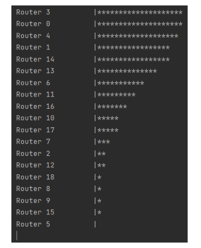
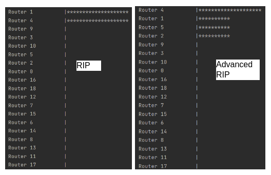

## Network Simulation for Telecommunications Course
Simulation of a real network from a university infrastructure. The goal of an experiment was to statistically determine the most busy router in a network and to perform troubleshooting by adjusting the possibilities for such network events as packet loss or router/network interface crash.

## Key features

This project simulates a network containing 19 routers with different interface connections. Using OOP principles, real-world entities such as routers, packets, fibres have been abstracted into Java objects. The Network class initialises the following topology.

Packets are passed from one router to another. Each host has a certain chance of crashing, including the MTTF parameter. Packets can also be lost if they don't reach their destination. Every router has a routing table. Packet routes are set up using the RIP protocol. Later, I made improvements to this protocol by adding a sensitivity to a router's load, so that the algorithm could choose the less loaded router if there were several options.
The random numbers, such as the total number of packets sent, are generated using a specific set of probability rules. The number of arriving packets follows Poisson and lognormal distribution, and the packet arrival time follows Erlang distribution. The probability of a router/interface crash or packet loss follows the Gaussian distribution with an additional MTTF parameter. 
Here is an example of a random simulations. Asterisk indicates number of packets received.

The results of the experiments are printed on a console. The conclusions correlate well with real network statistics and were well received by the instructor.

